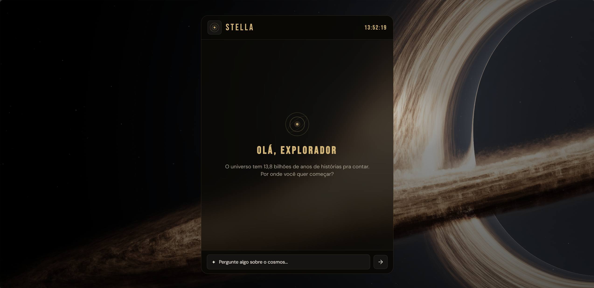

# Stella - Chatbot de Astronomia

Stella é um chatbot desenvolvido para responder perguntas sobre astronomia de forma interativa. O sistema utiliza processamento de linguagem natural para identificar intenções e gerar respostas sobre temas como buracos negros, estrelas, planetas e o universo.

## Interface

<p align="center">
  
</p>

## Tecnologias utilizadas

* Python
* Flask
* SQLite
* NLTK
* HTML
* CSS
* JavaScript

## Funcionalidades

* Chat interativo em tempo real
* Identificação de intenções com NLP
* Respostas com base em uma base de conhecimento estruturada
* Sistema de followup para continuidade da conversa
* Suporte a imagens nas respostas
* Interface responsiva

## Estrutura do projeto

backend

* chatbot.py
* database.py
* models.py
* routes.py
* intents.py

frontend

* index.html
* style.css
* script.js

## Como executar o projeto

1. Clone o repositório
2. Crie um ambiente virtual
3. Instale as dependências

```bash
pip install -r requirements.txt
```

4. Execute a aplicação

```bash
python -m backend.main
```

5. Acesse no navegador

```
http://127.0.0.1:5000
```

## Observações

* O banco de dados é criado automaticamente na primeira execução
* O projeto utiliza SQLite para persistência de dados
* A pasta .idea não faz parte do projeto
