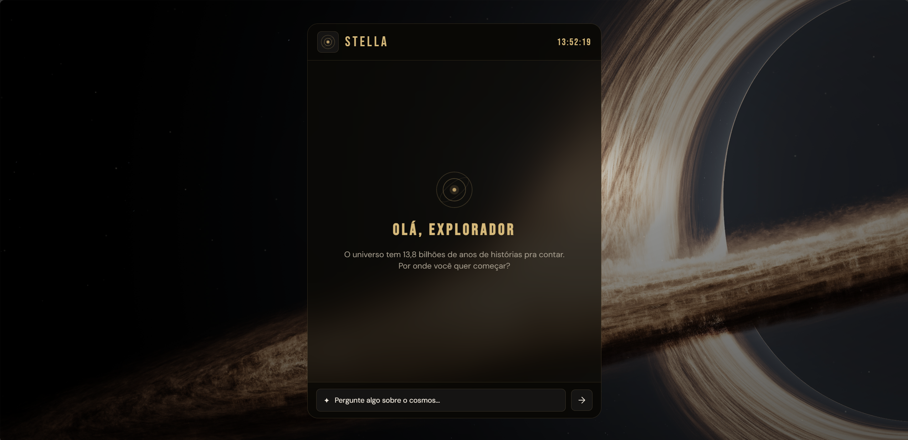

# Stella - Chatbot de Astronomia

Stella é um chatbot inteligente desenvolvido para responder perguntas sobre astronomia de forma interativa. O sistema utiliza uma arquitetura **BDI (Beliefs, Desires, Intentions)** combinada com processamento de linguagem natural (PLN) para identificar intenções, consultar uma base de conhecimento factual estruturada e, se necessário, utilizar um modelo de linguagem (LLM - Qwen2.5) para gerar respostas sobre temas como buracos negros, estrelas, planetas e o universo.

## Interface

<p align="center">
  
</p>

## Tecnologias utilizadas

* **Python 3.13** (Linguagem de programação principal)
* **Flask & Flask-CORS** (Servidor web e gerenciamento de requisições API)
* **SQLite** (Persistência de sessões e histórico de mensagens)
* **spaCy & Stemmer RSLP** (Processamento de Linguagem Natural e lematização)
* **Transformers & PyTorch** (Execução local e remota do modelo LLM)
* **HTML, CSS & JavaScript** (Interface do usuário responsiva e dinâmica)
* **TF-IDF & Similaridade de Cosseno** (Algoritmo de busca por similaridade na base de dados)

## Funcionalidades

* **Chat interativo em tempo real** com interface responsiva e moderna.
* **Identificação de intenções com NLP** e normalização de texto avançada.
* **Respostas com suporte a imagens** da base de conhecimento para temas astronômicos.
* **Fallback Inteligente (LLM)**: perguntas fora da base de conhecimento são encaminhadas para o modelo Qwen2.5-7B-Instruct (via API remota do Hugging Face ou local).
* **Três modos de operação do LLM**:
  * `remoto` (HF Inference Providers)
  * `local` (GPU/CPU local)
  * `auto` (cascata automática: tenta remoto primeiro, se falhar usa local)
* **Memória de Sessão & Followup**: o chatbot mantém o contexto das últimas mensagens para responder a perguntas sequenciais.
* **Anti-alucinação**: filtros para garantir que fatos críticos e superlativos científicos sejam servidos apenas pela base de dados.

## Estrutura do projeto

O projeto está organizado em uma estrutura modular:

**backend**

* `main.py` (Ponto de entrada principal do servidor Flask)
* **api**
  * `routes.py` (Definição de endpoints e gerenciamento do fluxo HTTP)
* **bot**
  * `bdi_models.py` (Classes que definem Crenças, Desejos e Intenções)
  * `intent_classifier.py` (Classificação de intenções do usuário)
  * `orchestrator.py` (Orquestrador BDI que escolhe entre base de conhecimento ou LLM)
* **db**
  * `database.py` (Inicialização e conexão com o banco SQLite)
  * `models.py` (Modelos ORM/tabelas para histórico de chat)
* **llm**
  * `fallback_service.py` (Gerenciador de inferência remota/local do Qwen)
* **nlp**
  * `text_utils.py` (Limpeza, normalização, stopwords e stemming)
  * `indexer.py` (Indexação de documentos usando TF-IDF)
  * `search_service.py` (Motor de busca usando similaridade de cosseno)
  * `image_service.py` (Pesquisa e seleção de imagens astronômicas correlacionadas)

**frontend**

* `index.html` (Visual e estrutura da página de chat)
* `style.css` (Estilização em CSS puro com visual moderno)
* `script.js` (Consumo da API backend e manipulação dinâmica do chat)

## Como executar o projeto

1. **Clone o repositório**:
   ```bash
   git clone <url-do-repositorio>
   ```

2. **Instale as dependências e o modelo spaCy**:
   ```bash
   pip install -r requirements.txt
   python -m spacy download pt_core_news_sm
   ```

3. **(Opcional) Instale o PyTorch com suporte a GPU (CUDA)**:
   > O PyTorch é instalado em versão CPU por padrão. Para rodar o modelo local via GPU NVIDIA:
   * Verifique a versão do CUDA (`nvidia-smi`)
   * Reinstale o PyTorch com o comando correspondente à sua versão do CUDA, por exemplo:
     ```bash
     pip install torch torchvision torchaudio --index-url https://download.pytorch.org/whl/cu124
     ```

4. **Crie o arquivo chamado `.env` na raiz do projeto e insira as seguintes chaves**:
   ```env
   # auto (remoto com fallback local), local (offline) ou remoto (HF Inference)
   LLM_MODE=auto

   # Token Hugging Face (https://huggingface.co/settings/tokens)
   HF_TOKEN=seu_token_aqui
   STELLA_REMOTE_MODEL=Qwen/Qwen2.5-7B-Instruct

   # Escolha conforme sua VRAM (1.5B para CPUs/PCs fracos, 7B para GPUs de 8GB+)
   STELLA_LOCAL_MODEL=Qwen/Qwen2.5-7B-Instruct

   # Define o tempo limite de espera (timeout) em segundos para a geração de respostas do modelo de linguagem (LLM).
   LLM_TIMEOUT=120
   ```

   > ⚠️ **IMPORTANTE**: O GitHub possui um mecanismo automatizado de varredura de segurança (*Secret Scanning*). Se você commitar o arquivo `.env` ou qualquer trecho de código        contendo o seu token ativo do Hugging Face (`HF_TOKEN`) para um repositório público, **o GitHub identificará a credencial exposta e ela será imediatamente revogada               (deletada/desativada) de forma automática pelo Hugging Face por segurança**. Para evitar que precise gerar um token novo toda vez, garanta que o arquivo `.env` esteja no seu        `.gitignore` e configure o token localmente apenas.

5. **Execute a aplicação**:
   ```bash
   python main.py
   ```

6. **Acesse no navegador**:
   Abra o endereço abaixo para interagir com a Stella:
   ```
   http://127.0.0.1:5000
   ```

## Observações

* **Banco de dados**: O arquivo SQLite (`stellar.db`) é criado automaticamente no primeiro início do servidor.
* **Modelo Local**: Na primeira vez que a Stella precisar rodar localmente, o modelo de LLM configurado em `STELLA_LOCAL_MODEL` será baixado para o disco (isso pode levar alguns minutos dependendo da conexão).
* **Ausência de GPU**: Caso utilize o processador (CPU) para inferência local, as respostas podem demorar entre 15 e 40 segundos.